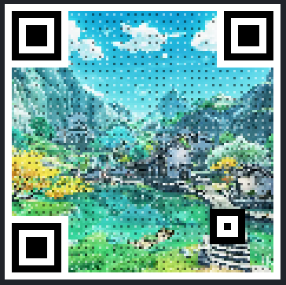

# pixel-art-in-QR
### Put pixel art (from any image) into a QR code

GitHub pages: https://neaflow.github.io/pixel-art-in-QR/

My own hosting: https://paq.neaflow.com/

## How to use it:
**1. Upload or paste in an image, and paste in or type a URL**

**2. Get the pixel-artified image**
That's it; the pixel art QR code is on the right.

##
QR code generator is courtesy of https://kazuhikoarase.github.io/qrcode-generator/js/demo/

This project was inspired by this Reddit post: https://www.reddit.com/r/PixelArt/s/KoCKF1Fe2T
I thought this was very cool but wanted it to be automated

## Once i stop being lazy:
- test button that uses QR scanning engine
- reset button
- make it look better
- make the output not the size of an ant
